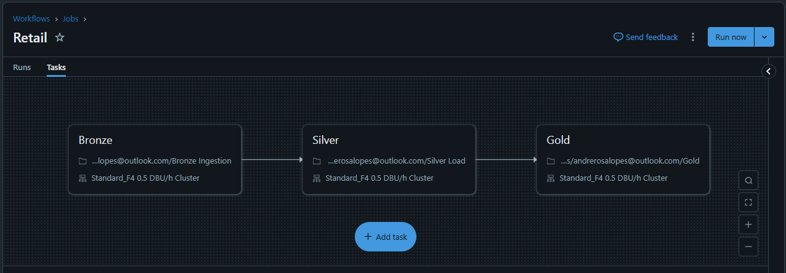
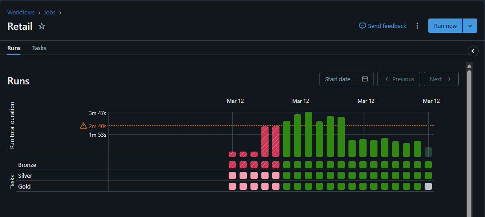
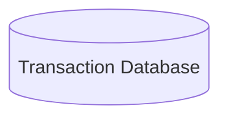
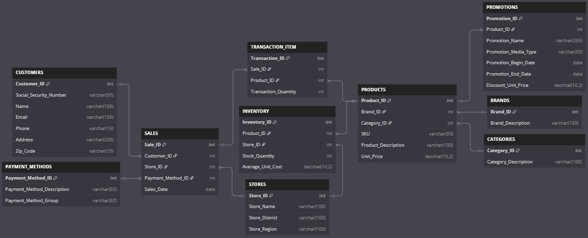
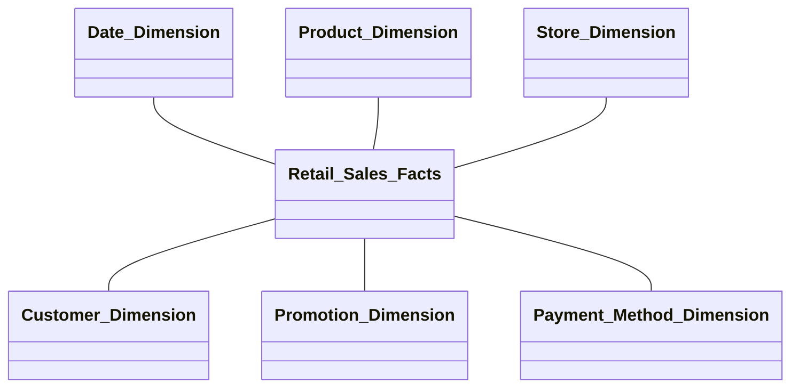
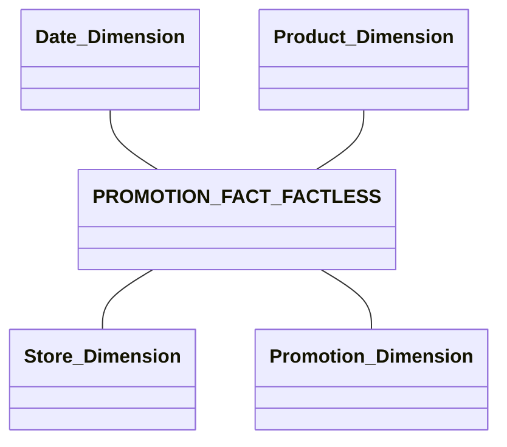

# Retail Sales Project with Azure and Databricks

## Objective
* Deepen my knowledge of Azure Databricks by building a complete data engineering pipeline.
* Develop an ETL pipeline following the Medallion Architecture.
* Implement and optimize PySpark and Spark SQL commands, including MERGE, timestamp handling, hashing, and SCD Type 2 (without Change Data Feed or Delta Live Tables).
* Design both a transactional and a dimensional model in Azure SQL Database.
* Reading directly from a database using JDBC (instead of typically working with JSON files, for example).
* Build a workflow in Databricks to orchestrate data extraction and OLAP data availability.
* Configuring a variety of Azure services: Azure Databricks, SQL server, SQL database, Storage account, Key vault.

## The project

```mermaid
graph LR
    A@{ shape: cyl, label: "SQL Azure Database" }
    subgraph BL["`**Bronze Layer**`"]

        B7[bronze.PAYMENT_METHODS]
        B6[bronze.PROMOTIONS]


        B3[bronze.BRANDS]
        B4[bronze.CATEGORIES]
        B2[bronze.PRODUCTS]
        B8[bronze.INVENTORY]
        B9[bronze.SALES]
        B10[bronze.TRANSACTION_ITEM]
        B1[bronze.CUSTOMERS]
        B5[bronze.STORES]
    end

    subgraph SL["`**Silver Layer**`"]
        S1[silver.CUSTOMERS]
        S2[silver.PRODUCTS_temp]
        S3[silver.BRANDS_temp]
        S4[silver.CATEGORIES_temp]
        S5[silver.PRODUCTS]
        S6[silver.STORES]
        S7[silver.PROMOTIONS]
        S8[silver.PAYMENT_METHODS]
        S9[silver.INVENTORY]
        S10[silver.SALES]
        S11[silver.TRANSACTION_ITEM]
        S12[silver.SALES_PRE_FACT]
    end

    subgraph GL["`**Gold Layer**`"]
        G1[gold.CUSTOMERS_DIMENSION]
        G4[gold.PROMOTION_DIMENSION]    
        G9[gold.PROMOTION_FACT_FACTLESS]
        G2[gold.PRODUCT_DIMENSION]
        G3[gold.STORE_DIMENSION]
        G5[gold.PAYMENT_METHOD_DIMENSION]
        G6[gold.RETAIL_SALES_FACTS]
        G8[gold.RETAIL_SALES_MONTHLY_FACT_SNAPSHOT]
    end

    A --> B7
    A --> B6
    A --> B3
    A --> B4
    A --> B2
    A --> B8
    A --> B9
    A --> B10
    A --> B1
    A --> B5

    S7 --> G4
    B1 --> S1
    B2 --> S2
    B3 --> S3
    B4 --> S4
    B5 --> S6
    B6 --> S7
    B7 --> S8
    B8 --> S9
    B9 --> S10
    B10 --> S11

    S1 --> G1
    S2 --> S5
    S3 --> S5
    S4 --> S5
    S7 --> G9
    S5 --> G9
    S5 --> G2
    S8 --> G5
    S2 --> S12
    S9 --> S12
    S10 --> S12
    S11 --> S12
    S6 --> G3

    S12 --> G6
    G6 --> G8

    style BL fill:#1a1a1a, stroke:#A97142,stroke-width:4px
    style SL fill:#1a1a1a, stroke:#c0c0c0,stroke-width:4px
    style GL fill:#1a1a1a, stroke:#DBAC34,stroke-width:4px
```

**Figure 1** - *Applied Medallion Architecture using Azure SQL database and Databricks.*

The implementation on Azure Databricks (workflows > jobs) would be like it:

**Figure 2** - *Retail job (for now, just working with customer table, not with entire proposed model).*

**Figure 3** - *Running the job.*
## Details (step by step)

**Preparing the environment in Azure cloud**
* Resource group
* Storage account with a container
* SQL server (and its database)
* Key vault
* Azure Databricks Service

**Basic configuration on Azure Databricks**
* Configuring the spark cluster and installing jdbc
* Mounting containers, directories and databases

:notebook: See notebook: [Basic configuration.ipynb](<Basic configuration.ipynb>)

* Proposed transaction model (and its dll)
* Configuring the Azure SQL database
* Creating tables and inserting sample data

:page_facing_up: See ddl file: [SQL_DataBase.ddl](SQL_DataBase.ddl)

```mermaid
graph LR
    BL[Bronze Layer]
    style BL fill:#1a1a1a, stroke:#A97142,stroke-width:4px
```

* Ingestion raw data (simple and standardized way)
* Lazy declare the tables for *__schema evolution__*
* Hard control the status of a row with *__merge__*: Deleted; Inserted; Updated pre image; and Update post image

```mermaid
graph LR
    SL[Silver Layer]
    style SL fill:#1a1a1a, stroke:#c0c0c0,stroke-width:4px
```

:notebook: See notebook: [Bronze Ingestion.ipynb](<Bronze Ingestion.ipynb>)

* *__Schema enforcement__*
* *__Data quality__*
* Type casting
* Handling of null and missing values
* Performing Joins

```mermaid
graph LR
    GL[Gold Layer]
    style GL fill:#1a1a1a, stroke:#DBAC34,stroke-width:4px
```

:notebook: See notebook: [Silver Load.ipynb](<Silver Load.ipynb>)

* Dimension model
* Implementing SCD Type 2 for the Customer Dimension
* Using materialized views

:notebook: See notebook: [Gold.ipynb](Gold.ipynb)

## Relational Model for the Transactional Database

**Figure 4** - *Proposed transaction model. Created using Dbdiagram.io*

[Code for Dbdiagram.io](Dbdiagram.io.dll)

## Dimensional Model

We aim to implement a dimensional model based on "Chapter 3 - Retail Sales" (KIMBALL, 2013).

**Figure 5** - *First star schema: Retail Sales Facts.*

**Figure 6** - *Factless Fact Table: PROMOTION_FACT_FACTLESS.*

We could propose a few other facts table like: periodic snapshot inventory; and monthly snapshot sales.

# Reference

KIMBALL, Ralph; ROSS, Margy. The data warehouse toolkit: the definitive guide to dimensional modeling. 3. ed. Hoboken: Wiley, 2013.

LEE, Denny; WENTLING, Tristen; HAINES, Scott; BABU, Prashanth. Delta Lake: The Definitive Guide. O'Reilly Media, 2025.

GIRTEN, Will. Building Modern Data Applications Using Databricks Lakehouse. 1st Ed. packt, 2024.

[What is the medallion lakehouse architecture?](https://learn.microsoft.com/en-us/azure/databricks/lakehouse/medallion) - https://learn.microsoft.com/en-us/azure/databricks/lakehouse/medallion .

etc.

